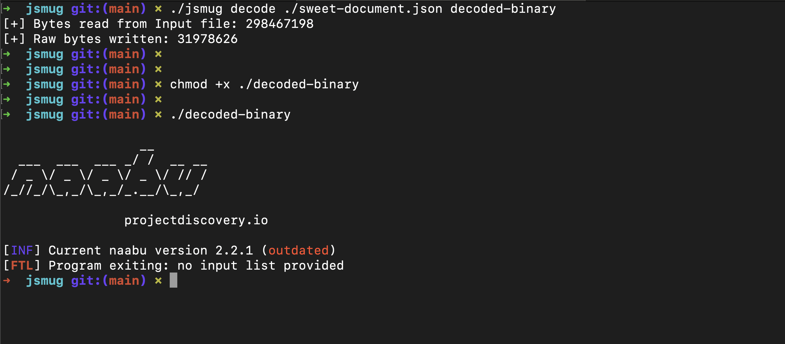

# jsmug - JSON Smuggler

`jsmug` is a simple PoC code for JSON smuggling technique. JSON smuggling technique takes advantage of insignificant bytes in a JSON document to smuggle arbitrary files.


<br/><br/>
## Usage

<br/>


### Compilation:
```bash
$ gcc jsmug.c -o ./jsmug
```

<br/>

### Encoding file:
```bash
$ ./jsmug encode <input_file_name> <output_file_name> <bytes_per_pair>
```
**Example:**
```bash
$ ./jsmug encode ./malicious-binary encoded-binary.json 20
```

In the below example, We encoded `naabu` binary in a JSON file named `sweet-document.json`.


<br/><br/>

### Decoding file:
```bash
$ ./jsmug decode <encoded_file_name> <output_file_name>
```
**Example:**
```bash
$ ./jsmug encode ./encoded-binary.json decoded-binary
```


In the below example, We decoded the `sweet-document.json` JSON file generated earlier to retrieve original `naabu` binary named `decoded-binary`.




<br/><br/>
## Background

<br/>

As per the [JSON RFC](https://datatracker.ietf.org/doc/html/rfc8259#section-2), Certain bytes known as insignificant bytes are allowed at certain positions in a JSON file. These insignificant bytes carry no meaning in a JSON document and hence are ignored by JSON parsing tools such as `jq`. There are 4 allowed insignificant bytes mentioned in the JSON RFC:

* 0x09 (Horizontal Tab)
* 0x0a (New Line)
* 0x0d (Carriage Return)
* 0x20 (Space)

Since these bytes are invisible to human eye and also ignored by JSON parsers, These 4 bytes can be used for encoding arbitrary data or file. Same as we use Base 2 system for representing something in binary format, We can use a Base 4 sytem to represent data using these 4 bytes.


```
                                      +---+---+                                                                                         
                --------------------  | A | B |  -------------------------                          Raw Bytes                           ▲
                |                     +---+---+                          |                                                              |
                |                                                        |                                                              |   ENCODING
                |                                                        |                                                              |       ▼
                |                                                        |                                                              |       ▼
                |                                                        |                                                              |       ▼
+---+---+---+---+---+---+---+---+                         +---+---+---+---+---+---+---+---+                                             |       ▼
| 0 | 0 | 0 | 0 | 1 | 0 | 0 | 1 |                         | 0 | 0 | 0 | 0 | 1 | 0 | 0 | 1 |         Base4 Representation                |       ▼
+---+---+---+---+---+---+---+---+                         +---+---+---+---+---+---+---+---+                                             |
                |                                                       |                                                               |
                |                                                       |                                                               |
                |                                                       |                                                               |
+----+----+----+----+----+----+----+----+         +----+----+----+----+----+----+----+----+                                             |
| \t | \t | \t | \t | \n | \t | \t | \n |         | \t | \t | \t | \t | \n | \t | \t | \r |         Custom Base4 Symbol Representation  |
+----+----+----+----+----+----+----+----+         +----+----+----+----+----+----+----+----+                                             |
                    \                                                 /                                                                 |
                     \                                               /                                                                  |
                      \                                             /                                                                   |
                       \                                           /                                                                    |
                        \                                         /                                                                     |
    +----+----+----+----+----+----+----+----+----+----+----+----+----+----+----+----+                                                   |
    | \t | \t | \t | \t | \n | \t | \t | \n | \t | \t | \t | \t | \n | \t | \t | \r |               Payload Bytes                       |
    +----+----+----+----+----+----+----+----+----+----+----+----+----+----+----+----+                                                   |
                                            |                                                                                           |
                                            |                                                                                           |
                                            |   bytes_per_pair = 5;                                                                     |       ▲
                                            |   no_of_pairs = ceil(8 * 2 / 5 ) = 4                                                      |       ▲
                                            |                                                                                           |       ▲
                                            |                                                                                           |       ▲
            +----------------------------------------------------------------+                                                          |       ▲
            | {"data":[\t\t\t\t\n{\t\t\n\t\t"json"\t\t\n\t\t:\r"smuggled"}]} |                      JSON Bytes                          |   DECODING
            +----------------------------------------------------------------+                                                          |
                       |=========| |=======|      |========| |=|                                                                        ▼
                            p1         p2             p3      p4
```
<br/>

The above ASCII diagram shows how raw bytes are represented in their Base4 representation. Then those Base4 bytes are mapped to their respective insignificant bytes. Based on the `bytes_per_pair` specified, The Base4 symbol bytes are divided in pairs and placed at certain locations in a JSON document. The ability to specify how many bytes should be together assits in bypassing any detection rules written specifically for this kind of action.


<br/><br/>
## Credits

<br/>

The idea of smuggling files/binaries/data using this technique was based on an article by [Grimminck](https://grimminck.medium.com/) named "[*JSON Smuggling: A far-fetched intrusion detection evasion technique*](https://grimminck.medium.com/json-smuggling-a-far-fetched-intrusion-detection-evasion-technique-51ed8f5ee05f)". In his article, He demonstrates an undisclosed PoC for this techniqe, I thought it would be nice to try to create one myself.


<br/><br/>
## Notes

<br/>

* While keeping a lower number for `bytes_per_pair` would be nice to evade IDS, Please make sure you are using a higher number of `bytes_per_pair` for files of bigger size as it might lead to size calculations exceeding `size_t` limit ultimately resulting in a segmentation fault.